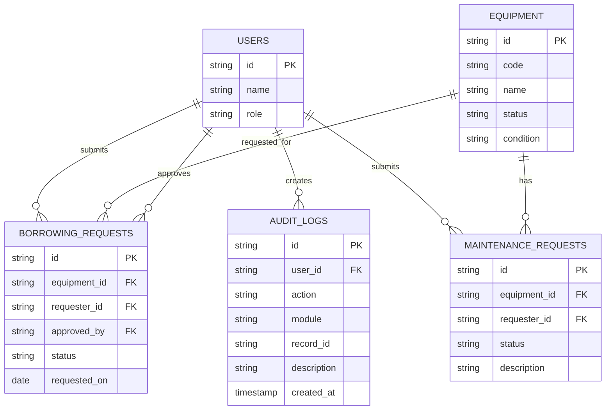
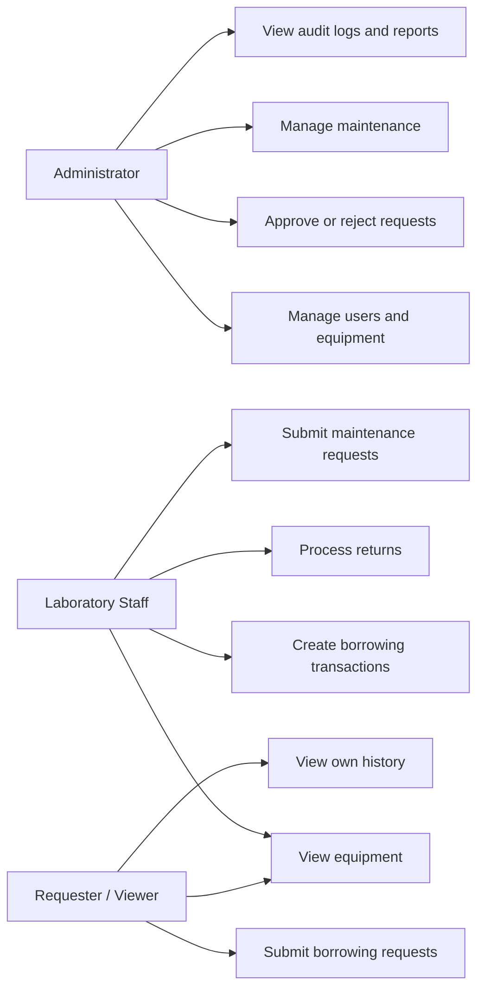
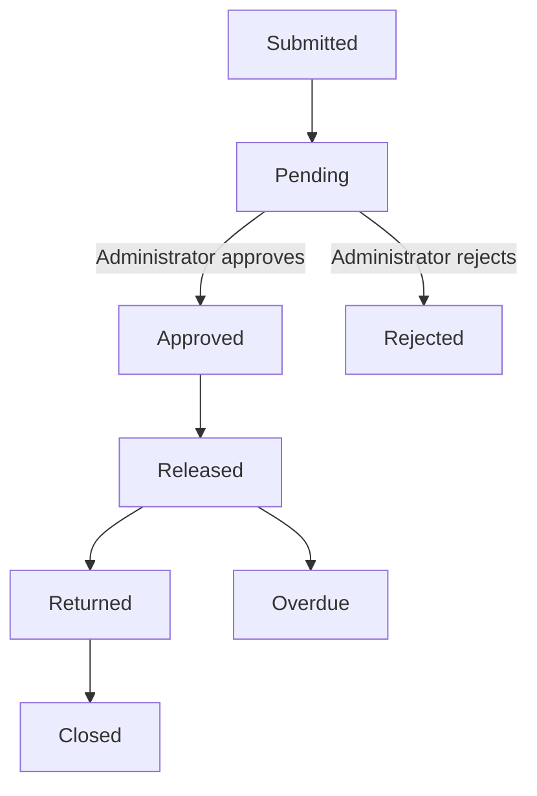

# Laboratory 4 Section A Design Deliverables

## ERD

## Use Case Diagram

## Permission Matrix

| Function | Administrator | Laboratory Staff | Requester / Viewer |
| --- | --- | --- | --- |
| View equipment | Yes | Yes | Yes |
| Submit borrowing request | Yes | Yes | Yes |
| Approve/reject request | Yes | No | No |
| Release/return equipment | Yes | Yes | No |
| Submit maintenance request | Yes | Yes | No |
| Manage users/equipment | Yes | No | No |
| View audit logs | Yes | No | No |
| View own history | Yes | Yes | Yes |

## Approval Workflow

## Business Rules

BR-A4-01 only available equipment may be requested. BR-A4-02 staff cannot approve their own request. BR-A4-03 only administrators approve or reject. BR-A4-04 only approved requests release. BR-A4-05 release marks equipment borrowed. BR-A4-06 return marks equipment available unless damaged. BR-A4-07 rejected requests cannot release. BR-A4-08 returned transactions cannot be processed twice. BR-A4-09 maintenance equipment cannot be borrowed. BR-A4-10 sensitive operations create audit entries.

## Functional Test Results

Run `php -l index.php` and `php -l lib/AssetSystem.php` before starting the server. Test the workflow manually through the PHP interface using the Administrator, Laboratory Staff, and Requester / Viewer accounts. The Audit Logs page provides the screenshot target after approving a request as Maria Santos.